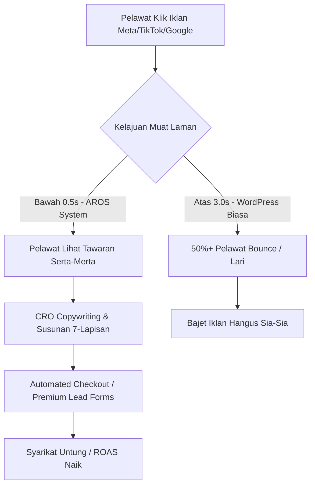
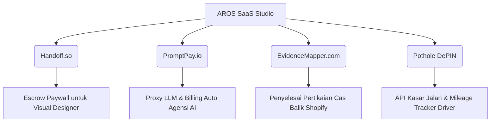
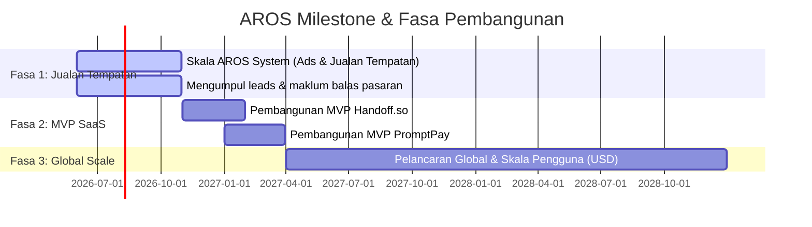

# 📑 RANCANGAN PERNIAGAAN (BUSINESS PLAN)
## BROMOVER RESOURCES SDN. BHD. — KUMPULAN TEKNOLOGI AROS
*Dokumen Sulit & Hak Cipta Terpelihara. Disediakan Khusus untuk Pelabur/Funder.*

---

## 📌 INDEKS / ISI KANDUNGAN (TABLE OF CONTENTS)

*   [**1. RINGKASAN EKSEKUTIF (EXECUTIVE SUMMARY)**](#1-ringkasan-eksekutif-executive-summary)
    *   1.1 Visi & Misi Syarikat
    *   1.2 Profil Syarikat (Bromover Resources Sdn. Bhd.)
    *   1.3 Model Perniagaan Dwi-Enjin (Dual-Engine Business Model)
    *   1.4 Keperluan Dana & Penggunaan Dana (Funding Ask)
*   [**2. PRODUK UTAMA: AROS SYSTEM (SALES ENGINE V2)**](#2-produk-utama-aros-system-sales-engine-v2)
    *   2.1 Definisi Masalah: Kebocoran Bajet Iklan & Kelajuan Halaman di Malaysia
    *   2.2 Penyelesaian: Next.js High-Performance CRO Sales Engine
    *   2.3 Ciri-Ciri Utama & Nilai Unik (Unique Value Proposition)
    *   2.4 Struktur Pakej Jualan & Harga (Pricing Matrix V2)
    *   2.5 Struktur Pakej Bundle & Model Retainer Bulanan (MRR)
    *   2.6 Portfolio Templat yang Telah Dihasilkan
    *   2.7 Traksi Awal & Sistem Penjanaan Lead (Lead Generation CRM Sync)
*   [**3. HALA TUJU EKSPANSI: PORTFOLIO MICRO-SAAS & AI DROP-SERVICING**](#3-hala-tuju-ekspansi-portfolio-micro-saas-ai-drop-servicing)
    *   3.1 Strategi "Ecosystem Parasite" & Penilaian Idea (Golden Parameters V2.0 & V3.0)
    *   3.2 **Handoff.so** (Secure Asset Vault & Escrow untuk Designer/Freelancer)
    *   3.3 **PromptPay** (Reverse Proxy & Automasi Billing AI Token untuk Agensi AI)
    *   3.4 **EvidenceMapper** (Automasi Dispute & Chargeback Shopify Subscription)
    *   3.5 **Pothole DePIN** (API Keadaan Jalan & Crawler Data Sensor Telefon Pintar)
    *   3.6 **LocalScale** (AI Programmatic SEO & Lead Gen Hyperlocal)
*   [**4. STRATEGI PEMASARAN & PENGAMBILAN PELANGGAN (GTM STRATEGY)**](#4-strategi-pemasaran-pengambilan-pelanggan-gtm-strategy)
    *   4.1 Model Pemasaran $0 CAC (Zero Customer Acquisition Cost)
    *   4.2 Arbitraj Trafik Carian Niat Tinggi (Google Ads Bottom-of-Funnel)
    *   4.3 Penglibatan Komuniti & Pemasaran Mikro-Influencer
*   [**5. OPERASI & INFRASTRUKTUR TEKNIKAL**](#5-operasi-infrastruktur-teknikal)
    *   5.1 Sistem Pelaksanaan Berbantu Ejen Kecerdasan Buatan (AI-Agent Fulfillment Engine)
    *   5.2 Unit Ekonomi & Margin Keuntungan
*   [**6. UNJURAN KEWANGAN & SASARAN MILESTONE**](#6-unjuran-kewangan-sasaran-milestone)
    *   6.1 Unjuran Kewangan 3 Tahun (3-Year Forecast)
    *   6.2 Sasaran Milestone & Fasa Pembangunan
*   [**7. PASUKAN PENGURUSAN**](#7-pasukan-pengurusan)
    *   7.1 Pengasas & Struktur Organisasi

---

## 1. RINGKASAN EKSEKUTIF (EXECUTIVE SUMMARY)

### 1.1 Visi & Misi Syarikat
*   **Visi:** Menjadi penyedia prasarana pengoptimuman kadar penukaran (CRO) dan ekosistem mikro-SaaS terulung di Asia Tenggara yang membolehkan pemilik bisnes memaksimumkan keuntungan digital dengan sifar pembaziran teknikal.
*   **Misi:** Membasmi ketidakcekapan sistem jualan digital tradisional melalui teknologi web ultra-pantas (Next.js), integrasi sistem automasi penuh, dan penciptaan produk perisian (SaaS) khusus yang menyelesaikan masalah aliran tunai dan operasi perniagaan kecil secara langsung.

### 1.2 Profil Syarikat
*   **Nama Syarikat:** BROMOVER RESOURCES SDN. BHD.
*   **No. Pendaftaran SSM:** 201901003230 (1312556-H)
*   **Alamat Pejabat Berdaftar:** Unit B-3A-22, 4th Floor, Block B, Ativo Plaza @ Damansara Avenue, 52200 Kuala Lumpur, Wilayah Persekutuan.
*   **Tahun Ditubuhkan:** 2019 (Aktif beroperasi dalam teknologi web dan automasi jualan digital).
*   **Pengasas & Pengarah Operasi:** Amin

### 1.3 Model Perniagaan Dwi-Enjin (Dual-Engine Business Model)
Kumpulan Teknologi AROS beroperasi menggunakan model dwi-enjin yang unik untuk memaksimumkan pulangan pelaburan dan meminimumkan risiko kegagalan:
1.  **Enjin 1: AROS System (Aliran Tunai Segera & Tinggi + Pendapatan Berulang MRR):** Agensi pembangunan halaman jualan (Sales Engine) CRO berprestasi tinggi berharga premium (RM999 - RM3,899+). Membina aliran tunai yang stabil melalui jualan lesen web sekali bayar, digabungkan dengan **sistem langganan retainer bulanan (RM350–RM449 sebulan)** untuk pengurusan iklan Google Ads dan penyelenggaraan Ejen Jualan AI.
2.  **Enjin 2: AROS Micro-SaaS Studio (Nilai Ekuiti Jangka Panjang):** Menggunakan aliran tunai daripada AROS System dan kepakaran pembangunan AI untuk membina portfolio perisian mikro-SaaS (seperti *Handoff.so*, *PromptPay*, dan *EvidenceMapper*) yang menyasarkan pasaran global (prosumer & B2B) dengan kos pemasaran $0 CAC dan pulangan pelaburan (LTV) yang tinggi.

```
+-------------------------------------------------------------+
|               AROS System (Agensi / CRO V2)                 | 
|  - Jualan Sistem Lesen Sekali Bayar (RM999 - RM2,500)       | ----> Menjana Cashflow Segera (MYR)
|  - Retainer Bulanan Pengurusan Iklan (RM350 - RM449/bln)    | ----> Menjana Pendapatan Berulang (MRR)
+-------------------------------------------------------------+
                               │
                               ▼ (Pendanaan Pembangunan Tanpa Hutang)
+-------------------------------------------------------------+
|                AROS Micro-SaaS Studio (SaaS)                | ----> Membina Nilai Ekuiti Jangka Panjang (USD)
+-------------------------------------------------------------+
```

### 1.4 Keperluan Dana & Penggunaan Dana (Funding Ask)
Kami sedang mencari rakan kongsi strategik untuk pusingan **Seed Funding sebanyak RM350,000** bagi mempercepatkan fasa pembangunan dan pemasaran portfolio ini:
*   **40% (RM140,000) - Pembangunan Produk SaaS:** Membina versi MVP (Minimum Viable Product) untuk *Handoff.so* dan *PromptPay* ke tahap sedia pasaran.
*   **30% (RM105,000) - Arbitraj Iklan & Pengambilalihan Pelanggan:** Skala kempen Google/Meta Ads untuk AROS System bagi meningkatkan jualan tempatan.
*   **20% (RM70,000) - Insfrastruktur AI & Server:** Membina API middleware dan menyewa GPU/ejen AI untuk melaksanakan fulfillment automasi.
*   **10% (RM35,000) - Operasi & Pematuhan Undang-undang:** Perlindungan harta intelek (IP), pendaftaran entiti SaaS global (cth: Stripe Atlas / US Delaware Corp), dan kos operasi.

---

## 2. PRODUK UTAMA: AROS SYSTEM (SALES ENGINE V2)

### 2.1 Definisi Masalah: Kebocoran Bajet Iklan di Malaysia
Kebanyakan peniaga digital (B2C, dropshipper, agensi, perniagaan lokal) di Malaysia membakar bajet iklan antara **RM500 hingga RM2,000 sebulan** di Meta Ads dan TikTok Ads, namun gagal mendapat penukaran jualan (conversion) yang optimum. 

Punca utama kegagalan dikesan pada landing page mereka yang dibina menggunakan WordPress/WooCommerce yang disewa pada hosting murah (RM10–RM30 sebulan):
*   **Kelajuan Laman yang Sangat Perlahan:** Purata masa muat laman web WordPress tempatan adalah **4.8 saat** (Audit Google Lighthouse). Lebih 50% pelawat yang mengklik iklan melarikan diri (bounce) sebelum sempat melihat tawaran.
*   **Reka Bentuk Berterabur (Bukan CRO):** Reka bentuk yang dibina secara tangkap muat menggunakan Elementor/Divi tanpa memikirkan susunan psikologi pembeli.
*   **Penjejakan Iklan (Tracking) Terputus:** Kehilangan data tracking pembeli akibat sekatan privasi Apple iOS 14+ dan penyekat iklan (AdBlock), menyebabkan kos iklan semakin mahal kerana algoritma pengiklanan tidak mendapat maklum balas data yang tepat.

### 2.2 Penyelesaian: Next.js High-Performance CRO Sales Engine
AROS System membina semula landing page peniaga dari asas menggunakan teknologi terkini: **Next.js (React Framework), Tailwind CSS, dan Framer Motion**, serta dihoskan pada pelayan edge global (Vercel CDN).



*   **Pemuatan Sepantas Kilat (Sub-0.5 saat):** Laman dibuka serta-merta pada peranti mudah alih dengan skor prestasi Google Lighthouse dijamin bertulis **95% ke atas**.
*   **Struktur CRO 7-Lapisan:** Rekaan disusun berdasarkan psikologi pembeli: (1) Headline cangkuk emosi, (2) Realiti pahit pasaran, (3) Portfolio bukti, (4) Bukti sosial/Testimoni, (5) Backstory telus, (6) 3-Langkah proses kerja, dan (7) Tawaran/Harga yang tidak boleh ditolak.
*   **Ejen Jualan AI (24/7 AI Sales Agent):** Sistem jualan interaktif berkuasa AI terintegrasi yang bertindak sebagai jurujual autonomi 24/7, bersedia menyaring prospek, menjawab soalan keraguan pembeli, dan menutup jualan secara automatik tanpa penglibatan manual staf.

### 2.3 Ciri-Ciri Utama & Nilai Unik
*   **No Monthly Fees:** Pelanggan bayar sekali, website menjadi hak milik mereka selamanya tanpa sebarang sewaan platform bulanan untuk lesen tapak web.
*   **SLA Kelajuan & Tempoh Siap Ditulis:** Draf pertama siap dalam masa bekerja. Lewat? Refund 100% tanpa drama.
*   **Set-and-Forget Infrastructure:** Sifar penyelenggaraan teknikal diperlukan oleh pemilik bisnes. Semua diuruskan oleh AROS.

### 2.4 Struktur Pakej Jualan & Harga (Pricing Matrix V2)

| Ciri & Spesifikasi | Pakej Launch (RM 999) | Pakej Authority (RM 1,899) | Pakej Corporate (RM 2,500) |
| :--- | :---: | :---: | :---: |
| **Harga Jualan** | **RM 999** *(Sekali Bayar)* | **RM 1,899** *(Sekali Bayar)* | **RM 2,500** *(Sekali Bayar)* |
| **Jenis Laman Web** | 1 Halaman (Landing Page) | 1 Halaman + Funnel Pages | Multi-page (Maks 7 Halaman) |
| **Kelajuan Laman** | Sub-0.5 saat (Skor >95%) | Sub-0.5 saat (Skor >95%) | Sub-0.5 saat (Skor >95%) |
| **Copywriting & Layout** | CRO 7-Lapisan Penuh | CRO 7-Lapisan Penuh | CRO Korporat Penuh |
| **Pengurusan Leads** | Hubung terus ke WhatsApp | Auto-Sync ke Google Sheets CRM | Integrasi Sistem CRM Penuh |
| **Domain Setup** | Percuma Tahun Pertama | Percuma Tahun Pertama | Percuma Tahun Pertama |
| **Sistem Checkout & PG** | ✗ | ✓ (Stripe/ToyyibPay/Billplz) | ✓ (Boleh ditambah) |
| **Order Bump & OTO Page** | ✗ | ✓ (Satu klik add-on + upsell) | ✗ |
| **Penjejakan Iklan (Tracking)**| Pixel Asas (Meta, TikTok, GA4) | API Penjejakan Server-side (CAPI)| Setup Tracking Korporat |
| **Rakaman Skrin Pelawat** | ✗ | ✓ (Microsoft Clarity Heatmap) | ✓ (Microsoft Clarity Heatmap) |
| **Jaminan Penghantaran SLA** | 72 Jam (3 Hari Bekerja) | 5 Hari Bekerja | 7 Hari Bekerja |
| **Ejen Jualan AI (Chatbot)** | Add-on Pilihan | Add-on Pilihan | Add-on Pilihan |

---

### 2.5 Struktur Pakej Bundle & Model Retainer Bulanan (MRR)
Untuk mewujudkan **pendapatan berulang bulanan (Monthly Recurring Revenue - MRR)** bagi agensi, kami telah memperkenalkan model **Stack** yang menggabungkan pembangunan tapak web, setup trafik Google Ads, dan integrasi Ejen AI:

#### 1. The Sniper Stack (RM 1,999 Sekali Bayar)
*   *Sasaran:* Pemilik bisnes yang mahukan pelancaran pantas dan penumpuan pada kutipan lead berkualiti.
*   *Kandungan:* Pakej Launch (RM 999) + Google Ads Setup (RM 1,799) (Penjimatan RM 799).
*   *Pendapatan Berulang:* **Retainer Google Ads RM 350 sebulan** bermula pada bulan kedua.

#### 2. The Growth Stack (RM 2,899 Sekali Bayar)
*   *Sasaran:* Peniaga e-commerce yang ingin memaksimumkan nilai purata pesanan (AOV) dan jualan automatik.
*   *Kandungan:* Pakej Authority (RM 1,899) + Google Ads Setup (RM 1,799) (Penjimatan RM 799).
*   *Pendapatan Berulang:* **Retainer Google Ads RM 350 sebulan** bermula pada bulan kedua.

#### 3. The Enterprise Stack (RM 3,899 Sekali Bayar)
*   *Sasaran:* Syarikat korporat/SME yang mahu sistem penjenamaan lengkap dengan pekerja jualan AI autonomi sepenuhnya.
*   *Kandungan:* Pakej Corporate (RM 2,500) + AI Sales Agent Setup (RM 799) + Google Ads Setup (RM 1,799) (Penjimatan RM 1,199).
*   *Pendapatan Berulang:* **Retainer AI & Google Ads RM 449 sebulan** bermula pada bulan kedua.

---

### 2.6 Portfolio Templat yang Telah Dihasilkan
Kami telah membina dan memvalidasi struktur reka bentuk ini merentasi pelbagai niche industri tempatan dengan hasil imej kualiti tinggi dan kelajuan optimum:
1.  **FitMelt Suplemen:** Landing page kesihatan & diet bertema pastel mesra pengguna.
2.  **Pet World:** Poster jualan makanan kucing organik premium (Single Screen).
3.  **Derma-Vant Serum:** Poster jualan serum pemulihan parut kulit berasaskan grid visual sebelum/selepas.
4.  **IgniteCore Burner:** Formula pembakar lemak selular bertema kontras bertenaga (teal-gold).
5.  **Yayasan Nur Cahaya:** Poster kempen infaq Al-Quran lengkap dengan lencana zakat negeri Perak.
6.  **Melt-10 Kemam:** Pakej jualan coklat slimming berasaskan tawaran "Beli 2 Percuma 1".
7.  **BioCore Sunnah Gold:** Kapsul kesihatan jantung dengan bukti publisiti media (TV3, Kosmo, KKM).
8.  **Majakani Plus:** Kapsul herba wanita dengan visual botol 3D dan testimoni berwibawa.

### 2.7 Traksi Awal & Sistem Penjanaan Lead
Sistem kami dipasang dengan borang pengoptimuman kadar penukaran interaktif (CRO Questionnaire) yang menyaring kelayakan lead sebelum mereka menghubungi kami. Setakat ini, pangkalan data kami (`leads.json`) telah merekodkan leads berkualiti tinggi yang di-sync secara automatik, membuktikan keberkesanan reka bentuk borang penukaran kami berbanding borang statik biasa.

---

## 3. HALA TUJU EKSPANSI: PORTFOLIO MICRO-SAAS & AI DROP-SERVICING

Menggunakan aliran tunai daripada AROS System, kami akan membina portfolio Micro-SaaS. Setiap idea telah ditapis menggunakan garis panduan **Golden Parameters V2.0 & V3.0** (Zero-touch sales, $0 CAC, ROI serta-merta, workflow lock-in tinggi, sifar mesyuarat, dan 100% dipacu oleh kecerdasan buatan).

### 3.1 Ringkasan Portfolio Produk SaaS



---

### 3.2 Handoff.so (Secure Asset Vault & Escrow untuk Designer)
*   **Masalah Utama:** Freelancer dan agensi reka bentuk (pereka logo, pembangun web, videografer) sering ditipu atau dilambatkan pembayaran invois akhir (50% bayaran baki) selepas menyerahkan fail projek. Sebaliknya, jika mereka menggunakan fail watermark statik, pelanggan sukar merasai pengalaman interaktif visual.
*   **Penyelesaian:** Sebuah portal simpanan aset selamat (Secure Asset Vault). Pereka memuat naik hasil kerja akhir ke dalam Handoff.so. Pelanggan menerima link untuk pratonton reka bentuk interaktif yang tidak boleh diekstrak (tanpa kod CSS, tanpa butang muat turun, visual ber-watermark). Butang "Download/Unlock" hanya aktif selepas pelanggan membayar invois baki terus di halaman tersebut. Pembayaran terus memicu pelepasan fail secara automatik.
*   **Monetisasi:** Langganan **RM120 sebulan ($29/mo)** flat untuk pereka kreatif, ATAU caj transaksi sebanyak **2%** bagi setiap transaksi yang berjaya dibayar.
*   **Moat & CAC:** CAC bernilai **RM0**. Setiap kali pereka menghantar link Handoff.so kepada pelanggan (yang juga pemilik perniagaan), pelanggan melihat cop jenama *"Powered by Handoff.so — Stop chasing unpaid invoices"*. Ini mencetuskan pemasaran tular organik (B2B viral loop).

---

### 3.3 PromptPay (Reverse Proxy & Automasi Billing AI Token)
*   **Masalah Utama:** Agensi Automasi AI (AAA) membina chatbot dan sistem sokongan untuk pelanggan mereka menggunakan akaun OpenAI/Anthropic agensi itu sendiri (kerana pelanggan tidak tahu cara mendapatkan API key). Agensi menanggung kos token API dahulu dan terpaksa mengira penggunaan setiap pelanggan secara manual pada akhir bulan — satu proses rumit yang sering menyebabkan agensi rugi.
*   **Penyelesaian:** Reverse Proxy pinggir (Edge Proxy) menggunakan Cloudflare Workers. Agensi menghalakan bot mereka ke `api.promptpay.io` dan bukannya ke API OpenAI secara langsung. Sistem kami menapis trafik, mengira token secara masa nyata, menambah margin keuntungan yang ditetapkan agensi (cth: markup 2x ganda), dan mengecas kad kredit pelanggan secara automatik menerusi Stripe Metered Billing pada akhir bulan.
*   **Monetisasi:** Langganan SaaS bertingkat antara **RM400 hingga RM1,200 sebulan ($99 - $299/mo)** bergantung kepada jumlah panggilan API.
*   **Moat:** Lock-in teknikal yang sangat ketat. Jika agensi membatalkan langganan PromptPay, semua chatbot pelanggan mereka serta-merta terputus dan tidak berfungsi.

---

### 3.4 EvidenceMapper (Shopify Chargeback dispute solver)
*   **Masalah Utama:** Kedai e-commerce yang menjual produk langganan (subscription) sering menghadapi pertikaian kad kredit (chargebacks). Peniaga kehilangan produk, terpaksa refund wang pembeli, dan didenda RM65 ($15) oleh Stripe bagi setiap pertikaian. Melawan pertikaian secara manual memerlukan masa berjam-jam untuk mengumpul bukti.
*   **Penyelesaian:** Aplikasi Shopify automatik yang mengesan pertikaian secara masa nyata. Ia menarik data penghantaran kurier, IP pelanggan, sejarah pesanan, dan perbualan e-mel secara automatik, menukarkannya kepada dokumen PDF bukti yang mematuhi piawaian bank, dan menghantarnya terus ke API Stripe.
*   **Monetisasi:** Pelan langganan SaaS flat bernilai **RM400 sebulan ($99/mo)** untuk peniaga berskala sederhana.
*   **Kelebihan Bersaing:** Pesaing sedia ada (seperti Chargeflow) mengambil caj peratusan yang mahal (20-25% daripada nilai wang yang diselamatkan). EvidenceMapper menawarkan harga tetap (Flat Rate) yang jauh lebih menjimatkan untuk kedai e-commerce besar.

---

### 3.5 Pothole DePIN (Crowdsourced Road Roughness API)
*   **Masalah Utama:** Syarikat logistik dan penghantaran kargo (J&T, DHL, NinjaVan) kerugian jutaan ringgit setahun akibat kerosakan kenderaan dan barang pecah semasa transit disebabkan jalan raya berlubang. GPS konvensional hanya mengira jarak dan masa terpendek, bukan kualiti fizikal jalan raya.
*   **Penyelesaian:** API Kualiti Permukaan Jalan Raya. Kami mengumpul data getaran (Z-axis accelerometer) secara pasif daripada telefon pintar pemandu harian untuk memetakan laluan jalan yang rosak. Data ini dijual kepada syarikat logistik untuk membolehkan sistem laluan (routing) mereka mengelak jalan berlubang.
*   **Monetisasi:** Langganan API korporat bermula dari **RM2,000 hingga RM20,000 sebulan** mengikut volum data.
*   **CAC Trojan Pemasaran:** Kami menawarkan aplikasi **Penjejak Batu & Tol Cukai Percuma** untuk pemandu e-hailing (Grab/Lalamove). Semasa aplikasi merekod perjalanan mereka untuk tuntutan cukai secara percuma, ia melombong data accelerometer di latar belakang secara pasif tanpa kos perkakasan tambahan.

---

### 3.6 LocalScale (Programmatic SEO Lead Gen)
*   **Masalah Utama:** Perniagaan tempatan bertaraf mikro (tukang paip, servis aircond, katering) sangat sukar dipaparkan di carian Google tempatan dan tidak mahu membayar kos iklan bulanan yang mahal.
*   **Penyelesaian:** Platform SEO Programmatik automatik. Sistem menjana 50+ landing page Next.js ultra-pantas secara automatik bagi setiap kawasan perumahan / bandar (cth: "Servis Aircond Subang Jaya", "Servis Aircond Cheras"). Semua butang panggilan diarahkan terus ke WhatsApp pemilik perniagaan.
*   **Monetisasi:** Sewaan bulanan tapak web programmatic sebanyak **RM150 - RM300 sebulan** bagi setiap niche lokasi yang dominan.

---

## 4. STRATEGI PEMASARAN & PENGAMBILAN PELANGGAN (GTM STRATEGY)

Syarikat kami menolak sekeras-kerasnya kaedah pemasaran konvensional yang membakar wang tanpa sasaran. Kami fokus sepenuhnya kepada 3 strategi berimpak tinggi:

### 4.1 Model Pemasaran $0 CAC (Ecosystem Parasite)
Kami membina perisian kami sebagai pemalam (plugins) atau sambungan (extensions) di platform yang sudah mempunyai jutaan pengguna bersedia-membeli (Shopify App Store, Figma Community, Make.com integration marketplace, Chrome Web Store). 
*   Apabila pengguna mencari penyelesaian kepada masalah mereka (cth: carian perkataan "chargeback control" di Shopify Store), produk kami muncul di tangga teratas hasil carian secara organik tanpa sebarang kos iklan berbayar.

### 4.2 Arbitraj Trafik Carian Niat Tinggi (Google Ads Search Arbitrage)
Untuk AROS System, kami tidak memujuk orang membeli. Kami menangkap pengguna yang sedang memegang kad kredit dan mencari penyelesaian hari ini.
*   Kami membida kata kunci carian seperti *"Bina Landing Page Nextjs Malaysia"*, *"Landing Page Murah Cepat"*, *"Fix website speed"* di Google Ads.
*   Kami menghalakan trafik ini ke borang kelayakan CRO interaktif kami yang menukarkan klik tersebut kepada jualan dalam masa 24 jam.

### 4.3 Pemasaran Berdasarkan Komuniti (Community Infiltration)
Untuk SaaS B2B seperti PromptPay:
*   Kami menyusup masuk ke dalam komuniti komuniti pengasas agensi AI (seperti kumpulan Skool, Reddit r/automation, Discord server).
*   Kami membongkar rahsia dan memberikan "Tutorial Percuma" bertaraf premium mengenai cara membina billing proxy tersendiri menggunakan Make.com.
*   Di akhir tutorial, kami membandingkan kelemahan sistem manual Make.com (lambat, mahal) dengan kelebihan sistem auto-billing PromptPay yang sedia guna. Ini menghasilkan kadar penukaran organik yang sangat tinggi.

---

## 5. OPERASI & INFRASTRUKTUR TEKNIKAL

### 5.1 Sistem Pelaksanaan Berbantu AI (AI-Agent Fulfillment Engine)
Kekuatan operasi Kumpulan Teknologi AROS terletak pada keupayaan kami mengekalkan bilangan kakitangan yang sangat minimum (Lean Team) melalui penggunaan ejen kecerdasan buatan (seperti *Antigravity*).

```
[ Pelanggan Order Pakej ] 
          │
          ▼
[ AI Agent (Antigravity) ] ──(Fulfillment)──> [ Menjana Copywriting, Kod Web, & Integrasi API ]
          │
          ▼
[ Pengesahan & Pengawasan Manusia (Amin) ] ──> [ Web Go-Live & Serahan Pelanggan ]
```

*   **Penyediaan Copywriting & Layout:** AI menganalisis maklumat perniagaan pelanggan dan menjana draf copywriting jualan CRO dan kod Next.js yang optimum dalam masa beberapa minit.
*   **Pengoptimuman Kelajuan:** Ejen AI menulis semula fail aset, mengecilkan saiz imej secara automatik, dan menyusun kod ke tahap kecekapan maksimum bagi memastikan skor Google Lighthouse berada pada paras >95%.
*   **Integrasi Pihak Ketiga:** Automasi penuh untuk memautkan pangkalan data dengan Google Sheets, setup akaun Stripe/ToyyibPay/Billplz, dan menghubungkan domain tersuai tanpa memerlukan pengaturcara manusia tambahan.

### 5.2 Unit Ekonomi & Margin Keuntungan
Oleh sebab kos pelaksanaan fizikal diuruskan sepenuhnya oleh sistem AI kami, kos overhed (COGS) setiap projek adalah sangat kecil:

*   **Kos Server (Vercel Edge & hosting):** Percuma / Bawah RM10 sebulan per projek.
*   **Kos Domain (.com/.my):** RM50 – RM120 setahun (Ditanggung oleh pelanggan selepas tahun pertama).
*   **Kos Token AI & API:** RM10 – RM25 per projek.
*   **Purata Margin Kasar AROS System:** **90% - 95%** bagi setiap projek yang terjual (Launch Package RM999 menghasilkan untung bersih kasar RM900+).

---

## 6. UNJURAN KEWANGAN & SASARAN MILESTONE

### 6.1 Unjuran Kewangan 3 Tahun (3-Year Forecast dalam MYR)

| Kategori Kewangan | Tahun 1 (2026) | Tahun 2 (2027) | Tahun 3 (2028) |
| :--- | :---: | :---: | :---: |
| **Hasil AROS System (Lesen Web)**| RM 180,000 | RM 350,000 | RM 500,000 |
| **Hasil AROS System (Retainer MRR)**| RM 36,000 | RM 140,000 | RM 280,000 |
| **Hasil Produk Micro-SaaS** | RM 50,000 | RM 450,000 | RM 1,800,000 |
| **Jumlah Pendapatan (Revenue)** | **RM 266,000** | **RM 940,000** | **RM 2,580,000** |
| *Kos Jualan (COGS)* | RM 18,000 | RM 50,000 | RM 135,000 |
| *Kos Pemasaran & Operasi* | RM 75,000 | RM 180,000 | RM 400,000 |
| **Keuntungan Kasar (EBITDA)** | **RM 173,000** | **RM 710,000** | **RM 2,045,000** |
| *Margin Keuntungan* | *65.0%* | *75.5%* | *79.2%* |

*Nota: Penambahan model retainer bulanan pengurusan Google Ads dan Penyelenggaraan AI di V2 telah meningkatkan unjuran hasil agensi AROS System (Retainer MRR) dan margin EBITDA keseluruhan berbanding unjuran asal.*

### 6.2 Sasaran Milestone & Fasa Pembangunan



*   **Fasa 1 (Suku 3 - Suku 4, 2026) - Skala Tempatan & Kestabilan Tunai:**
    *   Mencapai sasaran jualan 15 - 20 Pakej Stack AROS System sebulan (Sniper, Growth, Enterprise).
    *   Menghasilkan MRR agensi sekurang-kurangnya RM5,000/bln daripada retainer pengurusan iklan Google Ads dan yuran langganan AI.
    *   Menstabilkan aliran tunai operasi syarikat melebihi RM35,000 sebulan.
*   **Fasa 2 (Suku 1 - Suku 2, 2027) - Pelancaran Produk SaaS Pertama:**
    *   Menyiapkan integrasi plugin Handoff.so dengan Figma API dan Stripe.
    *   Melancarkan ujian Beta Handoff.so kepada 100 pereka kreatif tempatan dan global.
    *   Memulakan promosi PromptPay di platform komuniti AI.
*   **Fasa 3 (Suku 3, 2027 dan Seterusnya) - Skala Global (USD):**
    *   Mencapai sasaran 1,000 pengguna berbayar pertama (MRR $29,000) untuk Handoff.so.
    *   Mendaftarkan entiti korporat di Amerika Syarikat untuk memudahkan pengurusan cukai dan pematuhan perundangan pembayaran global.

---

## 7. PASUKAN PENGURUSAN

### 7.1 Pengasas & Struktur Organisasi
*   **Amin — Pengasas & Pengarah Operasi:**
    *   Mempunyai pengalaman luas dalam pengurusan operasi perniagaan digital, strategi pemasaran ads (Google/Meta), dan reka bentuk sistem penukaran CRO di Malaysia. Menerajui visi strategik, perhubungan pelabur, dan kualiti penyampaian produk Bromover Resources Sdn. Bhd.
*   **Rangkaian Rakan Teknikal AI (Antigravity & Pembangun Luar):**
    *   Syarikat disokong oleh ejen kecerdasan buatan bertaraf elit untuk pembangunan kod web, API integrasi, dan automasi, memastikan kos pembangunan perisian dapat ditekan pada tahap paling minimum.

---
*Rancangan Perniagaan ini adalah tertakluk kepada perubahan dan kemas kini berkala berasaskan keadaan pasaran yang sebenar. Segala maklumat di dalamnya adalah sulit.*
