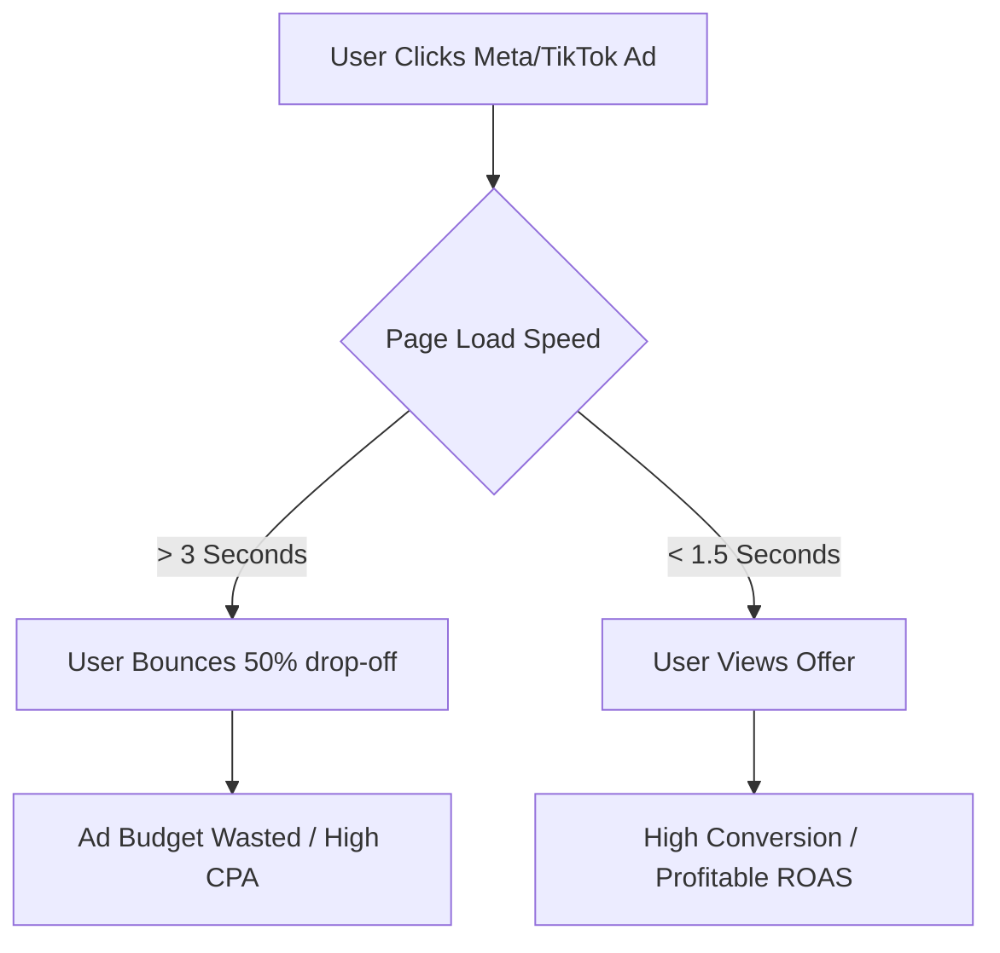

# Demand Signal Intelligence Audit: Landing Page Performance & Ad Waste in Malaysia

> [!NOTE]
> This audit explores pain points experienced by Malaysian B2C e-commerce founders, dropshippers, and product creators, specifically focusing on slow page load times, high bounce rates, ad budget waste on Meta/TikTok, and their willingness to pay for a RM999 high-speed sales page service.

---

## 1. Direct Evidence & Pain Points of Slow Page Speed and Ad Waste

In the Malaysian B2C landscape, mobile-first traffic dominates, with the majority of users browsing social commerce on mobile data (4G/5G). Laman web yang lambat (slow loading pages) is a critical bottleneck that directly affects Return on Ad Spend (ROAS).

### Key Pain Points Identified:
*   **The "Losing Traffic" Leak:** Malaysian B2C founders notice that while their Meta/TikTok Ads click-through rate (CTR) is high, their actual landing page views are significantly lower. Visitors click the ad but bounce before the site fully loads.
*   **Expensive Ads (Kos Ads Mahal):** Low-quality landing page experience drops Google/Meta ad quality scores. This causes the cost per click (CPC) and cost per acquisition (CPA) to skyrocket.
*   **Hosting Bottlenecks:** Many local merchants start on WooCommerce/WordPress hosted on cheap shared plans (RM10–RM30/month). When they launch a viral ad campaign, the sudden traffic surge crashes the server or causes severe page lags ("sangkut").
*   **Unoptimized Elements:** Large uncompressed product images, bloated plugins, and multiple tracking pixels (Meta Pixel, TikTok Pixel, Google Analytics) are common culprits slowing down local landing pages.



### Direct Quotes & Observations from Local Forums/Blogs:
*   *"Duit ads dah lebur RM500 tapi satu sales pun tak masuk. Bila check, rupa-rupanya landing page loading macam kura-kura..."* (Facebook Ads Support Group Malaysia)
*   *"WooCommerce ni best sebab custom, tapi kalau guna hosting murah memang selalu sangkut waktu peak hours."* (Lowyat.NET Tech & Business thread)
*   *"Bila page lambat load, customer terus exit pergi beli kat Shopee. Melayang duit iklan."* (Local dropship merchant community)

---

## 2. Platform Comparison: Performance & Friction Points

Malaysian B2C merchants typically choose between three options, each with distinct speed and operational tradeoffs:

| Platform | Strengths | Friction Points / Performance Issues |
| :--- | :--- | :--- |
| **WooCommerce / WordPress** | Highly customizable; no monthly subscription; integration with local payment gateways (ToyyibPay, SenangPay, Billplz). | Often bloated with page builders (Elementor/Divi), unoptimized images, and slow database queries. Easily bottlenecks on shared hosting. |
| **Yezza / Orderla** | Easy WhatsApp checkout integration; ideal for local B2C/dropshipping; rapid setup. | Limited custom design flexibility. Performance can degrade if page has excessive media assets or during platform-wide traffic spikes. |
| **Shopify** | High speed out of the box; excellent CDN; highly reliable. | High monthly cost (USD-denominated); transaction fees; premium themes and app subscriptions add up quickly. |

---

## 3. Willingness to Pay (WTP) in the Malaysian Market

The market for landing page creation in Malaysia is divided into distinct pricing tiers:

1.  **Low-End Tier (RM400 – RM800):** 
    *   *Providers:* Shopee freelancers, amateur page builders.
    *   *Features:* Templated WordPress pages, minimal optimization, generic copywriting.
    *   *Buyer Persona:* Micro-sellers and beginner dropshippers with tight budgets.
2.  **Mid-End Tier (RM800 – RM2,000):**
    *   *Providers:* Specialized freelancers, boutique web designers.
    *   *Features:* Speed-optimized pages, local payment gateways, mobile-responsive layout, lightweight copywriting.
    *   *Buyer Persona:* Active B2C founders, established dropshippers spending RM1,000+ monthly on ads.
3.  **High-End Tier (RM2,000+):**
    *   *Providers:* Digital agencies.
    *   *Features:* Custom sales funnels, SEO strategy, branding, copywriting, and CRM integration.
    *   *Buyer Persona:* SMEs and corporate brands.

> [!TIP]
> Founders spending RM1,000 to RM10,000+ per month on Meta/TikTok ads are highly receptive to paying for performance because they understand that a slow page literally burns their daily ad budget.

---

## 4. Verdict on Demand Strength for a RM999 High-Speed Sales Page Service

### Demand Rating: **Strong / Highly Viable**

A flat **RM999** high-speed sales page service is highly viable in the Malaysian B2C market, provided it is positioned correctly.

```
                  ┌──────────────────────────────────────────────┐
                  │   Position as: "AD BUDGET SAVINGS SERVICE"   │
                  └──────────────────────┬───────────────────────┘
                                         ▼
                 ┌────────────────────────────────────────────────┐
                 │  A 1-second load speed reduction saves 10%-20% │
                 │  of wasted ad clicks, paying for itself.       │
                 └────────────────────────────────────────────────┘
```

### Strategic Positioning Guidelines:
1.  **Do Not Sell "Web Design":** Avoid selling it as a generic web design service. Position it as a **"Conversion Rate Optimization (CRO) & Ad-Waste Prevention"** service. 
2.  **Target the Ad Spenders:** Focus on active advertisers who are already spending money on Meta/TikTok. Proving the ROI is easy: *If they spend RM3,000/month on ads and a slow page wastes 30% of clicks (RM900), the RM999 service pays for itself in just one month.*
3.  **Core Deliverables to Stand Out:**
    *   **Guaranteed Speed:** Mobile load speed under 1.5 seconds on Malaysian mobile networks (3G/4G/5G).
    *   **Local Checkout Ready:** Seamless integration with ToyyibPay, Billplz, or SenangPay.
    *   **Clean Code / Jamstack:** Built using lightweight framework architectures (e.g., Static HTML/CSS, Tailwind, Astro, or highly optimized WordPress) to guarantee performance.
