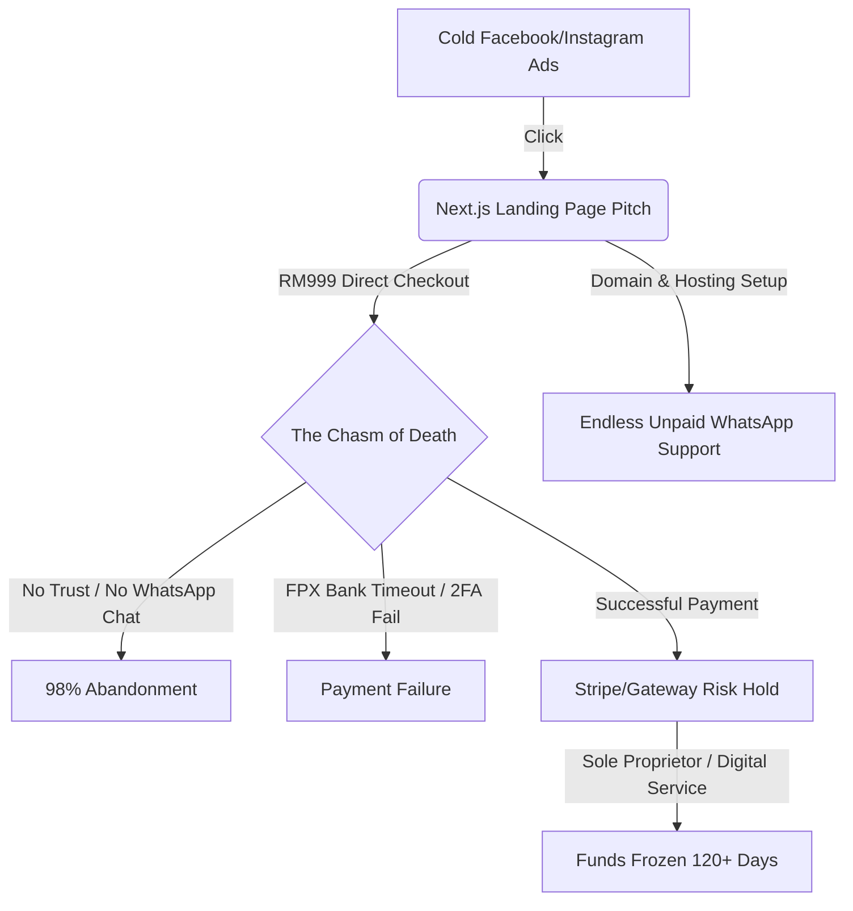

# DEVIL'S ADVOCATE AUDIT: RM999 Next.js Direct-Checkout Landing Page Funnel for Malaysian B2C Founders

> [!WARNING]
> **Executive Summary:** Running cold traffic paid ads directing Malaysian B2C founders to a direct-checkout page for a RM999 Next.js landing page will fail. It ignores the deeply ingrained conversational purchase behavior in Malaysia, undercuts value expectations using buzzwords ("Next.js") that B2C founders do not care about, and exposes the business to massive technical delivery friction and payment holds.

---

## 1. Top 5 Failure Reasons for This Model in Malaysia



### Reason 1: The "WhatsApp First" Relational Trust Chasm
Malaysian B2C founders (SMEs, local cosmetics, fashion, F&B owners) have a deeply ingrained transactional habit: **"Biasa WhatsApp dulu baru beli"** (chat first before buying). They are highly relational, protective of their cash flow, and deeply skeptical of online scams. Pitching a RM999 B2B service on a landing page and expecting them to enter credit card/FPX details immediately without speaking to a human is conversion suicide. Without a "Tanya Kami" (Ask Us) WhatsApp button, the bounce rate will hover near 99%.

### Reason 2: Stripe Malaysia Fraud Detection & Fund Holds
Stripe Malaysia is notoriously sensitive about digital service agencies and sudden high-ticket transactions.
* **Risk Profiles:** Selling a RM999 digital setup service from a fresh Stripe account without physical shipping logs triggers automatic risk flags.
* **Sole Proprietor Penalties:** If the service seller is registered as an SSM Enterprise (sole proprietorship) or uses a personal bank account, Stripe will freeze payouts for 90 to 180 days to mitigate potential chargeback risks.
* **No Local Recourse:** Getting a hold lifted requires submitting signed client contracts, SSM corporate documents, and proof of work delivery—often taking weeks while cash flow dries up.

### Reason 3: "Next.js" is a Feature B2C Founders Don't Care About
The pitch heavily relies on the technical superiority of Next.js (SSR, performance, SEO, React). The target audience (Malaysian B2C founders) doesn't know or care about Next.js.
* They want to know: *Can I connect my EasyParcel account? Does it sync with my Shopee store? Can I use ToyyibPay? How do I edit my product prices?*
* When you tell them it's custom coded in React, they realize they cannot edit it themselves using a simple drag-and-drop builder, viewing it as a **liability** rather than a feature.

### Reason 4: FPX Integration & Bank Downtime Friction
In Malaysia, credit cards are rarely the primary payment method for business services; **FPX (online banking)** is king. Integrating FPX checkout directly has major points of failure:
* **Midnight Maintenance:** Malaysian banks (especially Maybank2u and CIMB Clicks) undergo scheduled system maintenance every midnight, causing transactions to fail.
* **TAC/2FA Failures:** SMS OTP delays from local telcos often cause checkout sessions to time out, leading to immediate transaction abandonment.
* **Payment Gateway Fees:** Standard FPX transactions via local gateways charge fees that cut into margins, while Stripe's FPX checkout has a higher minimum fee structure.

### Reason 5: The "Free IT Support" Trap (Domain & DNS Friction)
Local B2C founders buy their domains from local registrars like **Exabytes, Shinjiru, or DomainPlus** which use legacy, confusing cPanel interfaces.
* **Handoff Nightmare:** Expecting a non-technical client to point their A/CNAME records to Vercel or Netlify is unrealistic.
* **Free Labor:** The vendor will spend hours on WhatsApp or TeamViewer resolving DNS propagation errors, SSL mismatch issues, and legacy email hosting setup—all for free, completely eroding the profitability of the RM999 price point.

---

## 2. Free & Cheap Local Alternatives (Competitive Threats)

Malaysian founders are highly cost-conscious. The RM999 value proposition faces immediate threats from localized SaaS and cheap agency services:

| Platform | Pricing (RM) | Target Fit for B2C Founders | Key Threat to RM999 Next.js |
| :--- | :--- | :--- | :--- |
| **Yezza** | RM47 - RM97/month | Built for WhatsApp commerce, easy forms, local payments. | Zero coding required. The client can edit pages in minutes. Contains built-in order management. |
| **Orderla.my** | Free - RM30/month | Simple product order forms, highly trusted locally. | Extremely cheap, direct integration with ToyyibPay/Billplz, designed specifically for Malay SMEs. |
| **EasyStore** | RM59 - RM239/month | Multi-channel commerce (Lazada, Shopee, TikTok Shop). | Seamless inventory synchronization across marketplaces—something a custom Next.js site cannot do cheaply. |
| **Local WordPress Freelancers** | RM150 - RM500 (One-off) | Elementor-built landing pages. | Floods Facebook Groups. B2C founders prefer Elementor because they can find any local gig worker to fix it for RM50. |
| **Shopee / Lazada Shops** | Free (Commission-based) | Default B2C checkout. | B2C founders already have these storefronts. They prefer to direct traffic to Shopee/Lazada where trust is already established. |

---

## 3. Technical Delivery Risks

```
[Design Phase] ---> [Development] ---> [Domain Handoff] ---> [Payment Gateway Integration] ---> [Maintenance]
                                                |                          |
                                        [cPanel DNS Nightmare]       [Stripe Hold / FPX Timeout]
```

1. **DNS Handoff & Email Breakage:**
   During the custom domain pointing process, changing DNS settings often breaks the client's existing corporate email (MX records) or Google Workspace settings. The developer will be blamed for "breaking my business email" and forced to do unpaid troubleshooting.
2. **Hosting Dependencies:**
   If hosted on Vercel/Netlify under the developer's account, it creates a lifetime dependency. If hosted on the client's own Vercel account, they must sign up, configure a credit card, and manage their own team settings, adding to the friction.
3. **Lack of CMS (Content Management System):**
   A raw Next.js site requires code edits. Even if integrated with a headless CMS (like Sanity or Strapi), the user interface is far too complex for a standard Malaysian B2C founder compared to WordPress, Yezza, or Shopify.

---

## 4. Trust Barrier Analysis for Direct Checkout

* **Scam Vigilance:** The Royal Malaysia Police (PDRM) and local media constantly warn against clicking random links and putting banking details into unknown websites. Direct checkout on a brand-new landing page without brand authority screams "Phishing / Scam site" to a cautious Malaysian business owner.
* **B2B is Not B2C:** While consumers buy RM30 shirts via direct checkout on Shopee, business owners spending RM999 on a B2B asset expect a quotation, invoice, and a face-to-face or virtual consultation. 
* **The "Zero Portfolio" Suspicion:** If the landing page does not showcase local brands (with SSM numbers displayed at the footer), trust drops to zero.

---

## 5. Final Viability Score & Suggested Modifications

### Viability Score: **2 / 10** (As a Direct-Checkout Cold-Ad Model)

> [!IMPORTANT]
> **Why it gets 2/10:** The combination of cold-traffic direct checkout, technical friction in handoff, lack of local trust, and payment gateway issues makes this specific acquisition funnel highly unviable. You will burn ad spend without conversions, and the few conversions you get will drain your resources in client support.

### Suggested Modifications to Make it Work:

1. **Pivot from Direct Checkout to "Book a Consultation" (WhatsApp/Calendly):**
   * Change the CTA from "Beli Sekarang (RM999)" to **"Bincang Projek via WhatsApp"** or **"Book Sesi Konsultasi Percuma"**.
   * Close the sale manually on chat. You can still charge RM999, but you build trust, explain the deliverables, and filter out high-maintenance clients.
2. **Drop the "Next.js" jargon; Sell "Pantas & Mesra WhatsApp" (Fast & WhatsApp Friendly):**
   * Market the landing page as a high-conversion tool that loads in 0.5 seconds (important for slow mobile data in East Malaysia/suburbs) and sends leads straight to WhatsApp.
3. **Use Local Payment Gateways with Manual Invoicing:**
   * Do not use Stripe for direct checkout. Instead, close the deal on WhatsApp and send a payment link via **ToyyibPay, Billplz, or Curlec** showing your SSM-registered business name, which builds immediate local credibility.
4. **Offer a Managed Hosting/Maintenance Package (Recurring Revenue):**
   * Instead of just selling a RM999 one-off landing page, charge RM999 + RM50/month for hosting, domain management, and minor text updates. This justifies handling the DNS setup nightmare because you secure recurring revenue.
5. **Target the "Premium B2C" Segment:**
   * Avoid micro-SMEs who compare you to a RM30 Orderla form. Target established Malaysian brands, clinics, or aesthetic centers who actually care about SEO, speed, and custom branding, and charge RM3,000+ instead of RM999.
